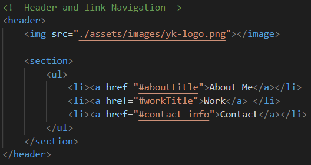
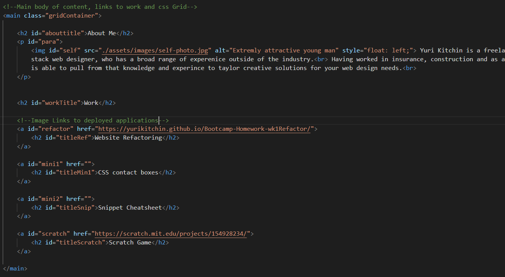
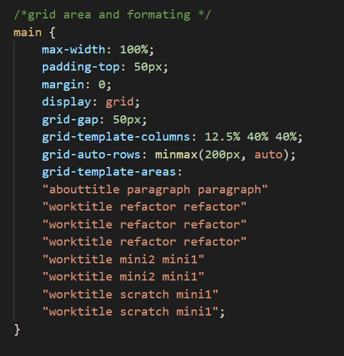
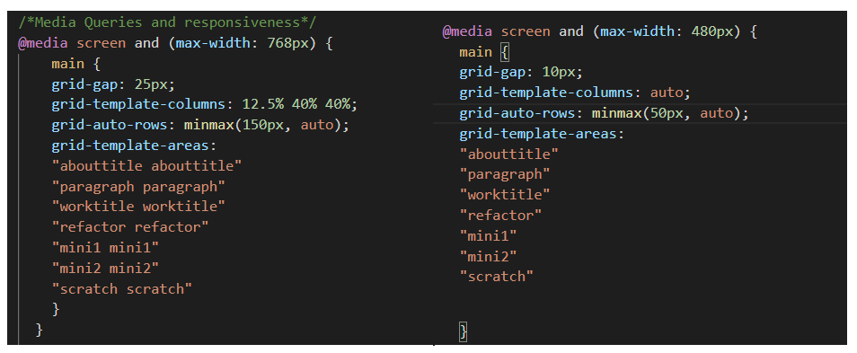
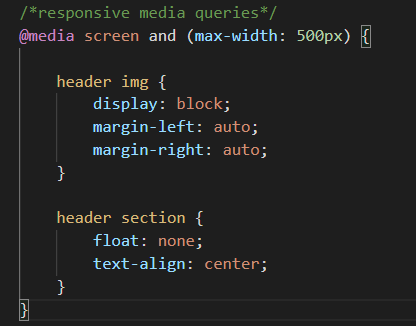

# Bootcamp-Homework-Wk2Portfolio
<h1 align="center">Professional full stack Portfolio</h2>

<h2>Purpose of Portfolio</h2>

This website is designed to showcase my professional skills by highlighting my strongest work through deployed applications

this website showcases who i am, a recent photo, and links to sections about me, my work, and how to contact me.

the links in the navigation section, scroll to the corresponding section of the UI

it contains images of my deployed applications that link to their deployed websites.

The site also contains a responsive layout, so it is possible to view it on different media devices

<h2 align="center">Main Functions</h2>
<h3>Functioning links to sections of website</h3>

The below html code, allows the user to click about me, work, or contact and the UI scrolls to that section of the page

<h3>Layout of portfolio and links</h3>

 i used this section to align and style the about me and the work sections. I used a Grid Layout to dictate the images also act as links to the deployed applications, through the use of the < a > tag

<h3>Responsive lay out</h3>

I added media querie with device breakpoints, that dictate how to change the page layout when viewing on different devices, the below code changes the grid layout

and this css code changes the layout of the heade

This website has been deployed on my github and is viewable at the link below

[Portfolio Website](https://yurikitchin.github.io/Bootcamp-Homework-Wk2Portfolio/)